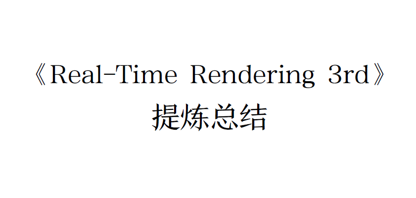
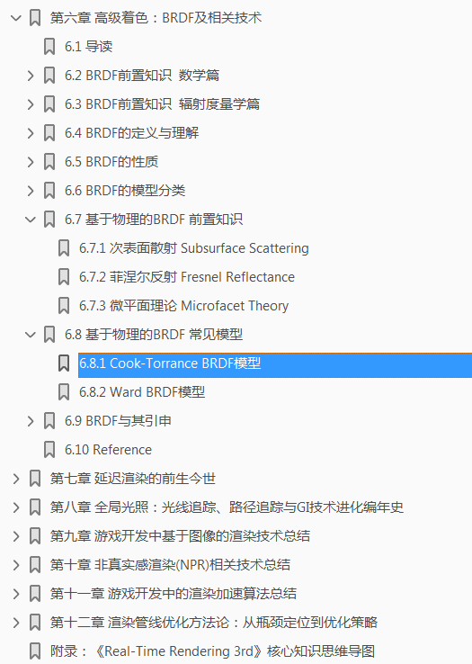
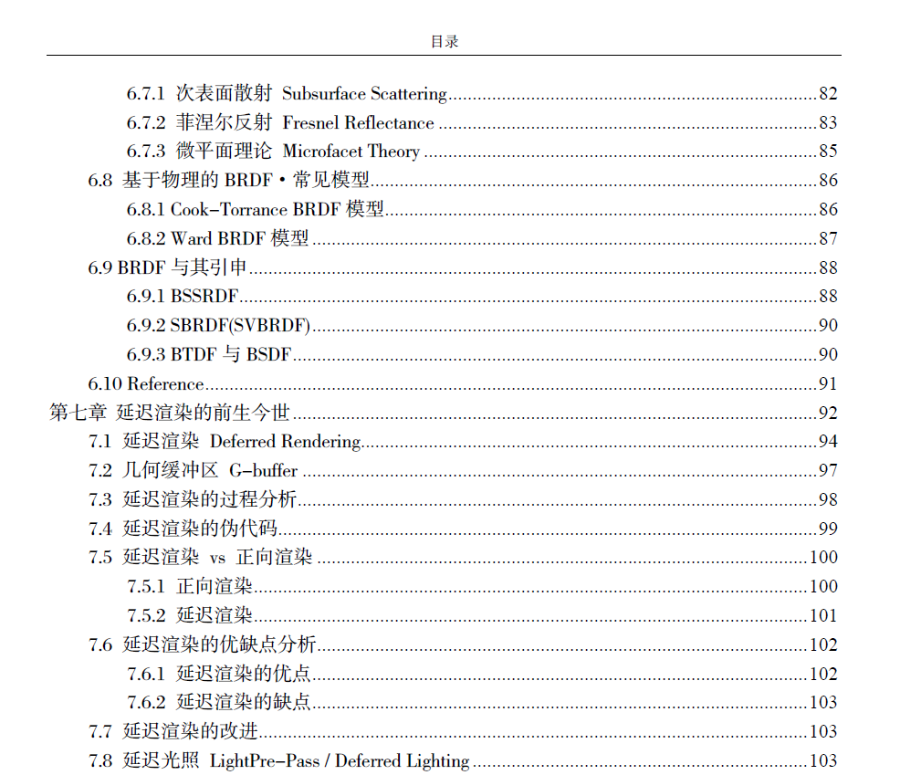
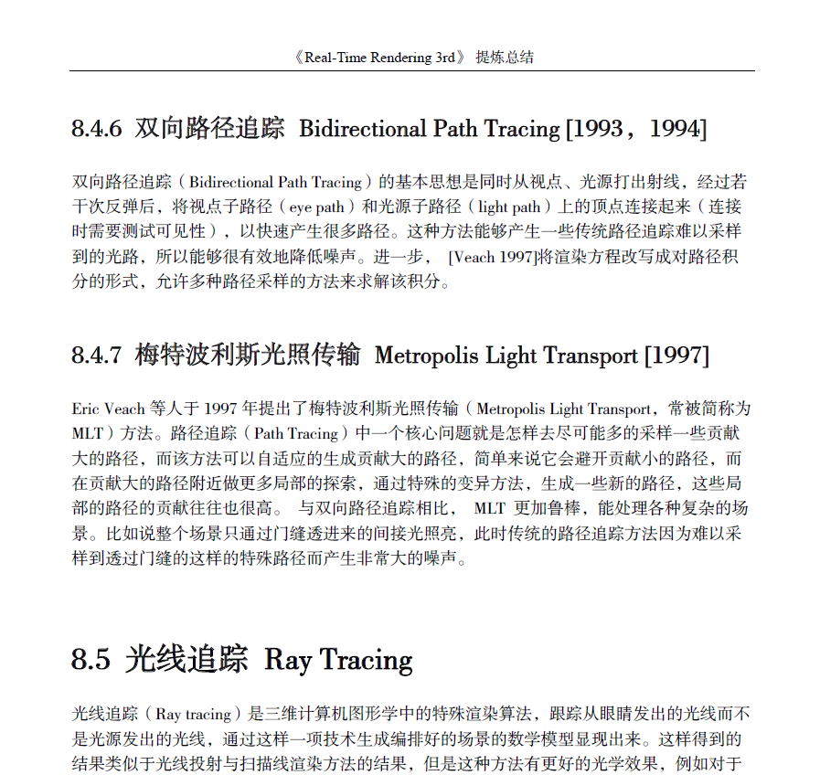

#電子書籍『リアルタイムレンダリング3rd』リファイン総集編』

この本は「リアルタイム レンダリング」というタイトルのシリーズ コラムの一部です。
第3弾「洗練された要約」は、合計97,000語以上を編集して編集したものです。 「リアルタイム レンダリング 3rd」の中国普及版と考えることもできますし、「リアルタイム レンダリング」と考えることもできます。
3rd」の解釈版と学習仲間です。

- **電子書籍の PDF ダウンロード リンク:
[《リアルタイムレンダリング》
第3回》洗練された概要.PDF](https://github.com/QianMo/Real-Time-Rendering-3rd-summary-Ebook/raw/master/%E3%80%8AReal-Time%20Rendering%203rd%E3%80 %8B%20%E6%8F%90%E7%82%BC%E6%80%BB%E7%BB%93.pdf)**

- **書籍に付属するマインド マップ「リアルタイム レンダリング ナレッジ ネットワーク マップ」のダウンロード リンク: [「リアルタイム レンダリング 3rd」コア ナレッジ ネットワーク マップ.jpg](https://github.com/QianMo/Real-時間レンダリング- 3rd-サマリー-Ebook/raw/master/%E3%80%8AReal-Time%20Rendering%203rd%E3%80%8B%E6%A0%B8%E5%BF%83%E7%9F%A5 %E8%AF %86%E7%BD%91%E7%BB%9C%E5%9B%BE%E8%A7%A3.jpg)**

# 電子書籍の序文

リアルタイム レンダリングとコンピュータ グラフィックスの分野では、書籍「リアルタイム レンダリング」シリーズが常に高く評価されています。 これはリアルタイム レンダリングのバイブルであるという人もいますが、比類のない武道のカタログであるという人もいます。

実は「リアルタイム」
「レンダリング」は、グラフィックスの主流の知識体系の論文レビューに非常によく似ており、コンピュータ グラフィックスとリアルタイム レンダリングのあらゆる側面をカバーしており、全体像を理解するための論文レビューのコレクションとして使用できます。今後の参考のための卓上参考書。

本書は、総語数97,000語を超える連載コラム「【『リアルタイムレンダリング3rd』抜粋と要約】」を書籍化したものです。 中国で普及している「リアルタイム」バージョンと考えることができます。
レンダリング 3rd」は、「リアルタイム レンダリング」と考えることもできます。
3rd」の解釈版と学習仲間が付属します。

この PDF の特徴:

- 純粋なテキスト バージョンであり、全文検索とクイック検索をサポートしています。

- 紙出版物の規格に準拠した精細なフォーマット

- 高精細画像付き

- ワンクリックで、対応する章の詳細な目次にアクセスします

- 各章とセクションに正確なブックマークがあります

- すぐに参照できる参考書として非常に適しています

内容に関しては、本全体が一連のコラムの順序でまとめられており、12 の章に分かれています。

- 第 1 章 本書の知識ポイントの概要

- 第 2 章 グラフィックス レンダリング パイプライン

- 第 3 章 GPU レンダリング パイプラインとプログラマブル シェーダー

- 第 4 章 グラフィック レンダリングと外観

- 第5章 テクスチャマッピングと関連技術

- 第 6 章 高度なシェーディング: BRDF と関連テクノロジ

- 第 7 章 遅延レンダリングの過去と現在

- 第 8 章 グローバル イルミネーション: レイ トレーシング、パス トレーシング、および GI テクノロジーの進化の年代記

- 第9章 ゲーム開発におけるイメージベースレンダリング技術の概要

- 第 10 章 ノンフォトリアリスティック レンダリング (NPR) 関連技術の概要

- 第 11 章 ゲーム開発におけるレンダリング高速化アルゴリズムの概要

- 第 12 章 レンダリング パイプラインの最適化手法: ボトルネックの場所から最適化戦略まで

- 付録: 「リアルタイム レンダリング 3rd」コア知識マインド マップ

「リアルタイムレンダリング」といえば
「3rd」は英語版では読みにくいですが、この本と合わせて読むと半分の労力で2倍の成果が得られるかもしれません。 リアルタイム レンダリングをすぐに始めたい人も、この本を読むことで何かを得られるはずです。

上で述べたように、この本は人気のある「リアルタイム レンダリング」の中国語版と考えることができます。
3rd」の解説版であり、「リアルタイム レンダリング 3rd」の学習支援版とも言えます。

各章とセクションに正確な図 PDF ブックマーク

図: ワンクリックで対応する章の書籍の目次にアクセス

図：本文は紙出版物の規格に従って丁寧に組版されています。

# 電子書籍コンパニオン - コア知識ネットワーク図のリアルタイムレンダリング

